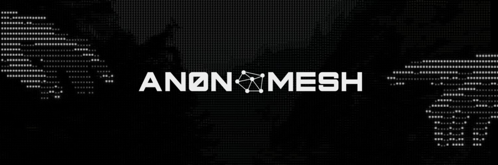

# anonmesh

**No centralized servers. No accounts. No surveillance. No bullshit.**

Encrypted mesh messaging and Solana payments for Android and iOS that works on a mountaintop, in the middle of the ocean, in a blackout, or anywhere the internet doesn't reach. If two devices can find each other over *anything* — Bluetooth, LoRa radio, LAN, the internet — they can talk. No carrier required. No cloud account. Community-run public TCP relays are pre-configured for bootstrap and can be removed in settings.

You own the keys. You own your share of the network. Nobody can take it from you.

---

## Why

Every messaging app you use today is a surveillance platform with a chat UI bolted on. Signal requires a phone number. WhatsApp is Meta. Telegram stores your messages on their servers. Even "decentralized" apps route through centralized relays, CDNs, or DNS.

anonmesh routes through whatever's available — peer-to-peer first, beacon-relays only when no direct path exists. It uses [Reticulum](https://reticulum.network), a cryptographic transport network that works over whatever physical medium is available, and [LXMF](https://github.com/markqvist/LXMF) for message delivery. There is no account creation. There is no central server to subpoena. There is no company to comply with a warrant. Your identity is a keypair that lives only on your device.

---

## Messaging

### Direct Messages

Scan a QR code or paste an LXMF hash. That's it. The message is encrypted end-to-end with X25519 + AES-128 + HMAC per the [Reticulum spec](https://reticulum.network/manual/understanding.html) before it leaves your device. If the peer is offline, the message queues locally and delivers the moment a path opens, over any interface, across any number of hops.

- No phone number. No username. No account.
- Peer status (online / offline, hop count, interface) live in the thread header
- Images and media over all transports
- Delivery states: queued → sent → delivered

### Channels

Encrypted multicast groups with a shared AES-128 key. No server coordinates membership. No admin can ban you. Any peer with the address and key is in, period.

**Create** · Open drawer → CHANNELS → CREATE → name it → done. Share the QR or `addr:key` pair.

**Join** · Open drawer → CHANNELS → JOIN → scan QR or paste address + key manually.

**Leave** · Swipe left on the channel row → LEAVE.

**Share** · Tap ↗ in the channel thread header → QR code + copyable address and key.

---

## Mesh Networking

The Nodes tab is a live radar of every peer your device can reach. Laid out by hop count, color-coded by transport, pan/pinch to explore. Tap any node for interface, hops, and latency. Fullscreen mode for the full picture.

**Transports — if the signal can carry bits, Reticulum will use it:**

- **LoRa via RNode** — kilometers of range with no infrastructure whatsoever. Pair your RNode over BLE directly in the app.
- **Bluetooth Low Energy** — direct device-to-device, no WiFi needed
- **TCP/IP** — LAN, internet, or any IP network as a backbone

Nodes relay messages forward. The more people run anonmesh, the stronger and wider the network gets. You are the infrastructure.

---

## Solana Wallet

Non-custodial. Keys never leave the device.

**On Solana Mobile (Seeker / Saga):** Mobile Wallet Adapter keeps keys in the device's hardware secure element. anonmesh never sees your private key.

**On everything else:** keypair generated and encrypted locally on first launch. Exportable. Never transmitted.

- SOL balance with live USD value
- All SPL token accounts, at a glance (Token program; Token-2022 not yet supported)
- Send SOL or SPL tokens to any Solana address; sending to a mesh peer handle is a roadmap item
- Receive via QR
- On-chain activity history
- Swap, yield, and confidential offline transfers (coming soon — roadmap previews are labeled in-app)

No analytics. No telemetry. RPC calls are limited to reading the chain and submitting transactions, and the endpoint is yours to configure. On mesh-RPC mode, requests are proxied through a beacon-relay (a future release will encrypt the JSON-RPC payload end-to-end to the relay).

---

## Identity & Privacy

- Keypair generated locally on first launch. Stored in the platform's hardware-backed keystore where available (iOS Keychain / Android Keystore with StrongBox or TEE); on older Android devices, expo-secure-store falls back to EncryptedSharedPreferences. Never uploaded anywhere.
- No sign-up flow. No email. No phone number. No verification.
- Display name exists only on your device — but if you choose to announce, your display name and (optional) beacon-mode tag travel in plaintext in the announce's `appData`. Direct-message contents and group payloads stay encrypted.
- Message contents are encrypted; routing metadata (the address hash, hop count, transport interface, and the appData above) is visible to nodes that forward your traffic.
- Lose the device, restore from your key export. No account recovery email. No support ticket. Sovereign.

---

## Installation

```bash
cd mobile_app
npm install
npx expo run:android   # or run:ios
```

Requires: Node 20+, Android Studio / Xcode, Expo CLI.

The native LXMF bridge (`@magicred-1/react-native-lxmf`) ships a prebuilt Rust library for both platforms. No extra native setup.

```bash
npx expo start --dev-client   # dev client mode
```

---

## Architecture

```
mobile_app/
  app/(tabs)/          # Messages, Nodes, Wallet, Settings
  components/
    messages/          # Composer, PeersDrawer, channel modals, QR scanner
    nodes/             # MeshMap topology canvas (pan/pinch/fullscreen)
    settings/          # RNode pairing, identity QR export
  context/
    LxmfContext.tsx    # Reticulum/LXMF bridge — peers, groups, send, identity
    WalletContext.tsx  # Solana — MWA / local keypair, connect/disconnect
  src/storage/         # SecureStore wrappers for identity + group registry
```

LXMF bridge is a React Native module backed by Rust. Groups and identity persist in SecureStore and re-register with the Rust layer on every node start.

---

## Compatibility

anonmesh speaks standard LXMF. It works with [Sideband](https://github.com/markqvist/sideband), [Nomad Network](https://github.com/markqvist/nomadnet), and any other LXMF-compatible client on the Reticulum network. Platform doesn't matter. Protocol does.
